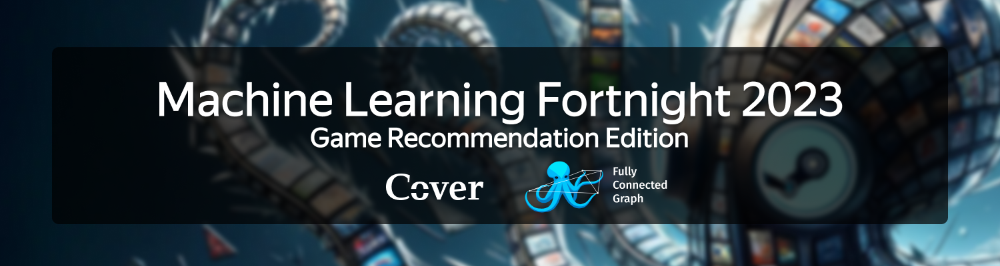
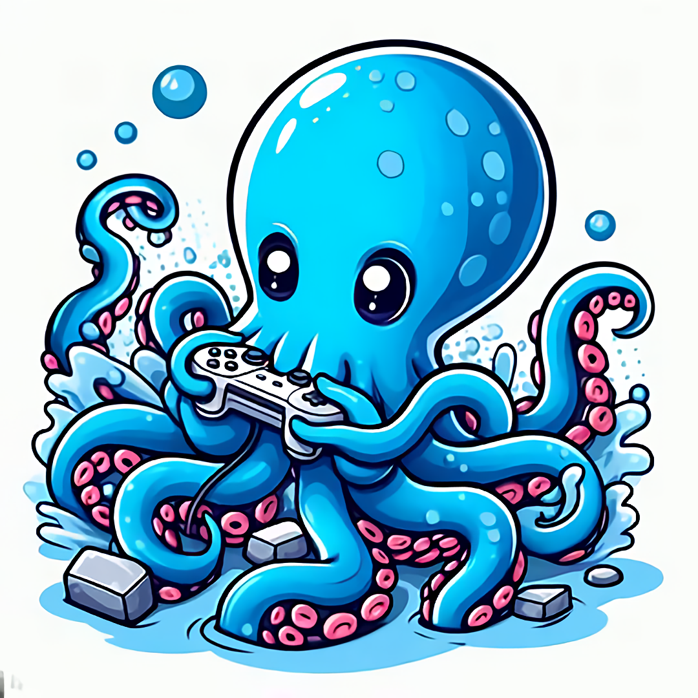

[][2]

Machine Learning Fortnight is the second edition of ML competitions orgnanized by the [Fully Connected Graph][1]. This year's task is to build the best algorithm to predict user ratings for video games. Along the way, there are 3 lectures to help you get started and learn how to apply machine learning to real-world problems.

Note that registration is **not necessary** if you simply wish to attend the lectures.

> #### Table of Contents
> [Event Structure](#event-structure)
> [Competition](#competition)
> [Prerequisites](#prerequisites)
> [Announcements and Communication](#announcements-and-communication)

## Event Structure

The event lasts a [fortnight](https://en.wikipedia.org/wiki/Fortnight), from 18th November to 1st December. 

The competition will be hosted on [Kaggle][3], where you will be able to submit your predictions and see how you rank against other participants.

There will be 3 lectures and an awards ceremony:

| Date | Time | Topic | Speaker
| --- | --- | --- | ---
| 20/11/2023 | 15:00 - 17:00 | Introduction to Recommender Systems | FCG
| 24/11/2023 | 15:00 - 17:00 | Natural Language Processing | FCG
| 27/11/2023 | 15:00 - 17:00 | Vector Databases | [Weaviate][weaviate]
| 01/12/2023 | 15:00 - 17:00 | Presentations / Awards Ceremony | you ;)

## Competition

To participate in the competition, register yourself [here][2], and you will receive an email with the link to the competition. 

You will be able to submit your predictions on Kaggle, and the leaderboard will be updated in real-time. The competition will end on 1st December at 15:00, and the winners will be announced at the awards ceremony.

The top teams will have to make a short presentation about their approach to the problem and present it at the awards ceremony. Judges will then decide the winners.

## Prerequisites

For the lectures and competition we expect you to have experience with Python and machine learning. Taking the Introduction to Machine Learning course is recommended, but not required.

Still, if you are a noob, don't worry! You can still participate in the competition and learn a lot along the way. **Check out our [resources](./resources) page** for some good starting points.

---

## Announcements and Communication

There will be announcements on lectures on Cover and [FCG whatsapp](https://chat.whatsapp.com/JynZLRD7yUr9f5OsQ1rzkb) groups.

If you have any questions you can ask them on our [Discord channel](https://discord.gg/JfzxyBHPsH).

<!--  -->

[1]: https://www.svcover.nl/committees?commissie=programming_committee "SV Cover Fully Connected Graph"
[2]: https://forms.gle/cXX3yp6xFRWstaQ18 "Registration Form"
[3]: https://kaggle.com/ "Kaggle"
[weaviate]: https://weaviate.io/ "Weaviate"